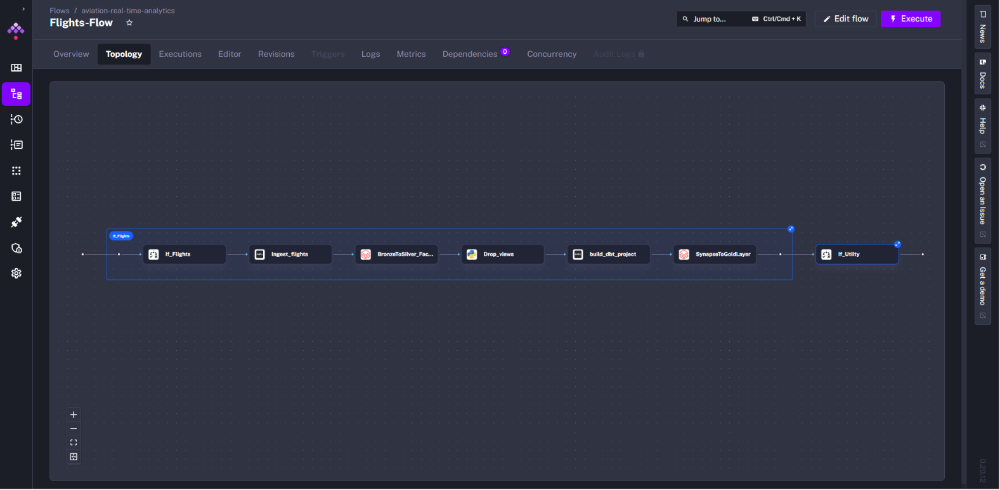
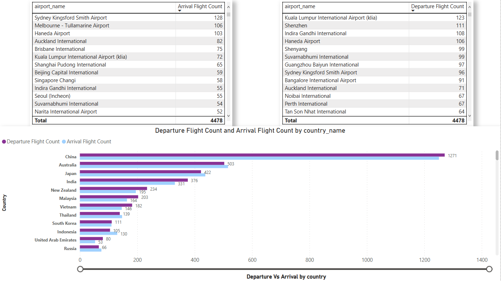

# Aviation Real Time Analytics

## Overview

This project is designed to analyze [AviationStack API's ](https://aviationstack.com)data using a combination of tools and platforms including Apache NiFi, Databricks, dbt, Azure Synapse, and Kestra. The project is structured to facilitate data ingestion, transformation, and analysis.

## Project Structure

- **Apache NiFi**

  - [NiFi_Flow.json](https://github.com/KareemAdel10/Aviation-Flights-Real-Time-Analytics/blob/master/Apache%20NiFi/NiFi_Flow.json) Contains the flow configuration for data ingestion and processing using Apache NiFi.
  - [`README.md`](https://github.com/KareemAdel10/Aviation-Flights-Real-Time-Analytics/blob/master/Apache%20NiFi/readme.md): Documentation for the NiFi flow.
    

    
- **Databricks**

  - [BronzeToSilver_FactTable.ipynb](https://github.com/KareemAdel10/Aviation-Flights-Real-Time-Analytics/blob/master/Databricks/BronzeToSilver_FactTable.ipynb): Notebook for transforming data from the Bronze to Silver layer for fact tables.
  - [BronzeToSilver_UtilityTables.ipynb](https://github.com/KareemAdel10/Aviation-Flights-Real-Time-Analytics/blob/master/Databricks/BronzeToSilver_UtilityTables.ipynb): Notebook for transforming data from the Bronze to Silver layer for utility tables.
  - [SynapseToGoldLayer.ipynb](https://github.com/KareemAdel10/Aviation-Flights-Real-Time-Analytics/blob/master/Databricks/SynapseToGoldLayer.ipynb): Notebook for transforming data from Synapse to the Gold layer.
- **dbt**

  - [dbt_project.yml](https://github.com/KareemAdel10/Aviation-Flights-Real-Time-Analytics/blob/master/dbt/dbt_project.yml): Configuration file for the dbt project.
  - [package-lock.yml](https://github.com/KareemAdel10/Aviation-Flights-Real-Time-Analytics/blob/master/dbt/package-lock.yml) and [packages.yml](https://github.com/KareemAdel10/Aviation-Flights-Real-Time-Analytics/blob/master/dbt/packages.yml): Dependency management files for dbt.
    
- **Azure Synapse Scripts**

  - SQL scripts for creating and managing external tables in Azure Synapse:
    - [dev script.sql](https://github.com/KareemAdel10/Aviation-Flights-Real-Time-Analytics/blob/master/Azure%20Synpase%20Scripts/dev%script.sql)
    - [External countries table.sql](https://github.com/KareemAdel10/Aviation-Flights-Real-Time-Analytics/blob/master/Azure%20Synpase%20Scripts/External%20countries%20table.sql)
    - [External flights table.sql](https://github.com/KareemAdel10/Aviation-Flights-Real-Time-Analytics/blob/master/Azure%20Synpase%20Scripts/External%20flights%20table.sql)
    - [External cities table.sql](https://github.com/KareemAdel10/Aviation-Flights-Real-Time-Analytics/blob/master/Azure%20Synpase%20Scripts/External%20cities%20table.sql)
    - [External airports table.sql](https://github.com/KareemAdel10/Aviation-Flights-Real-Time-Analytics/blob/master/Azure%20Synpase%20Scripts/External%20airports%20table.sql)
    - [External airlines table.sql](https://github.com/KareemAdel10/Aviation-Flights-Real-Time-Analytics/blob/master/Azure%20Synpase%20Scripts/External%20airlines%20table.sql)
    - [External airplanes table.sql](https://github.com/KareemAdel10/Aviation-Flights-Real-Time-Analytics/blob/master/Azure%20Synpase%20Scripts/External%20airplanes%20table.sql)
- **Kestra**

  - [flow.yml](https://github.com/KareemAdel10/Aviation-Flights-Real-Time-Analytics/blob/master/Kestra/flow.yml): Configuration for Kestra workflows.
  - [README.md](https://github.com/KareemAdel10/Aviation-Flights-Real-Time-Analytics/blob/master/Kestra/readme.md): documentation for the kestra flow
    
    
- Power BI:

  - [dashboard.pbix](https://github.com/KareemAdel10/Aviation-Flights-Real-Time-Analytics/blob/master/dashboard.pbix) a dynamic [dashboard](https://app.powerbi.com/links/MTvIODZSbN?ctid=7f3a6ceb-c511-477b-a21a-ea83ceae53d8&pbi\_source=linkShare) that should be refereshed after each flow execution to get the latest insights.
    

    

## Setup Instructions

1. **Environment Configuration**

   - Ensure you have Docker and Docker Compose installed.
   - Set up environment variables in the `.env` file.
2. **Running the Project**

   - Use the `Makefile` to manage Docker services and NiFi flows.
   - Start services with `make up` and stop them with `make down`.
3. **Data Ingestion and Processing**

   - Use Apache NiFi to manage data flows.
   - Transform data using Databricks notebooks.
   - Use dbt for data modeling and transformation.
4. **Database and Storage**

   - Azure Synapse is used for data storage and processing.
   - Ensure firewall rules are set up as per `main.tf`.
5. **Workflow Orchestration**

   - Use Kestra for orchestrating workflows.

## Additional Information

- **Terraform**: Infrastructure as code is managed using Terraform scripts (`main.tf`).
- **Docker**: Dockerfiles and `docker-compose.yml` are used to containerize and manage services.

## License

This project is licensed under the MIT License.
